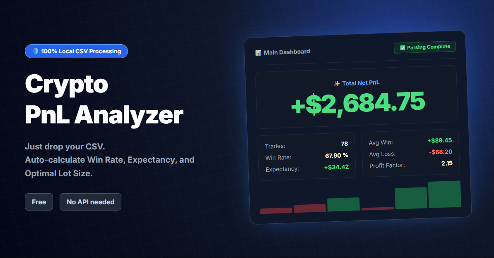

# 📊 Crypto PnL Analyzer (Derivatives & Futures Only)

> **⚠️ IMPORTANT: Dedicated to Crypto Derivatives / Futures Only (Spot trading NOT supported)**
> **⚠️ 重要：仮想通貨デリバティブ・先物取引専用ツールです（現物取引のCSVには対応していません）**
>
> Drop your CSV, get your edge. Zero server, 100% local.
> CSVを投げるだけ。サーバーを使わない完全ローカルの仮想通貨先物トレード解析ダッシュボード。

👉 **[Live Demo (English)](https://crypto-pnl-analyzer.vercel.app/)** | 👉 **[Live Demo (日本語)](https://crypto-pnl-analyzer.vercel.app/ja.html)**

---

## ⚠️ Disclaimer & Constraints (免責事項・制約事項)

> **This tool is a simplified application dedicated exclusively to crypto derivative/futures trade review and self-analysis. We do not guarantee the accuracy of its calculated results. Spot trading data is completely unsupported.**
> 本ツールは仮想通貨のデリバティブ・先物取引の振り返り・自己分析のみを目的とした簡易ツールであり、計算結果の正確性を保証するものではありません。現物取引のデータには一切対応しておりません。
>
> **Under no circumstances should this tool be used for official tax calculations or tax returns.**
> 確定申告などの公的な税務計算には絶対に使用しないでください。
>
> **We assume no responsibility or liability for any damages or losses incurred as a result of using this tool. Please use it entirely at your own risk.**
> 本ツールを利用したことによるいかなる損害についても責任を負いません。すべて自己責任でのご利用をお願いいたします。

---

## 💡 Features (特徴)

* 🛡️ **100% Local Processing (完全ローカル処理):** No server uploads. Your financial data never leaves your browser, ensuring complete privacy. / サーバーへのデータ送信は一切ありません。資産データがブラウザ外に出ることはなく、プライバシーは完全に保護されます。
* 📊 **Instant Derivatives Analytics (即座に先物データを自動解析):** Automatically calculates True Net PnL, Win Rate, Profit Factor, and Expectancy per trade including funding fees (FR). / 手数料や先物特有の資金調達料（FR）を反映した真の勝率、Profit Factor、1トレードあたりの期待値を一瞬で算出します。
* 🧠 **Max Risk per Trade (最大リスク算出):** Position sizing simulator based on the mathematical Kelly Criterion model to manage capital efficiency. / 過去の統計データから、破産リスクを抑えて効率よく資金を回すための「1トレードあたりの最大リスク（許容損失）」を数学的に算出します。
* 📅 **Advanced Insights (多角的な視覚化):** Discover your edge with daily/hourly heatmaps and post-losing streak analysis. / 勝ちやすい曜日・時間帯がひと目でわかる熱マップや、リベンジトレードの癖を暴く「連敗直後のトレード成績分析」を搭載。

---

## 🚀 How to Use (使い方)

1. **Open the App (サイトを開く):** Access the Live Demo link above in any modern web browser. / 上記のライブデモのリンクからブラウザでサイトを開きます。
2. **Drag & Drop (CSVをドロップ):** Drop your **futures/derivatives** trade history CSV file(s) into the zone. You can drop multiple files at once (e.g., Trade + Funding History). / 取引所からダウンロードした**先物・デリバティブの履歴CSV**をドロップするだけです。取引履歴と資金調達履歴など、複数ファイルの同時読み込みにも対応しています。

---

## 🏦 Supported Exchanges (対応取引所)

### 🌟 Optimized for (動作確認・最適化済み)
* **Hyperliquid**
  Currently optimized and tested to ensure the smoothest parsing experience. / 現状、最もスムーズに解析できるよう、調整・最適化しています。

### 🧪 Experimental Support via Generic Parser (自動判別・汎用パーサー)
* **Binance (USDT-M Futures), Bybit (USDT Perpetual), OKX (Perpetual/Futures), GMO Coin, etc.**
  The tool attempts to automatically parse standard crypto derivative/futures trade history CSVs. *(Spot trading or some specific transaction types are NOT supported. Due to exchange CSV specifications, funding fee matching may be limited.)* / 一般的なデリバティブ・先物取引の履歴CSVであれば自動判別して読み込みを試みます。（※現物取引のデータや、取引所ごとの特殊な明細種別には非対応です。また取引所のCSV仕様により、一部FRのロング/ショート自動割り当てが固定表示になる場合があります）

---

## 📮 Unsupported Format Reporting (非対応フォーマットの報告箱)

> **If your futures CSV is not parsed correctly, you can report the format via the link in the tool's footer under the following strict conditions:**
> エラー等で正しく読み込めない先物フォーマットについては、以下の条件をご了承の上、フッターの「報告箱」よりお知らせください。
>
> * **Strictly NO CSV Data (実際のトレード履歴・個人情報は送信禁止):** For privacy protection, strictly **DO NOT** submit actual trade history or personal information. Please only provide the "Exchange Name" and "Header Row (1st line)". / プライバシー保護のため、実際のトレード履歴（数値データ）や個人情報は**絶対に送信しないでください**。読み込めなかった「取引所名」および「1行目の項目名（ヘッダー）」のみ入力してください。
> * **No Individual Support (個別対応・返信なし):** This tool is provided as-is. We do not guarantee individual replies, fixes, or support for requested formats. / 完全無料のツールにつき、個別対応や個別のご返信、フォーマット対応の確約はいたしかねます。
> * **AI Processing (AIによる要約処理):** Feedback submitted may be processed, summarized, and categorized by AI for continuous improvement purposes. / いただいた情報は、ツールの改善・分類のため、AIによる要約処理に利用させていただく場合があります。

---

## 🔗 Referral Link (招待リンクについて)

This project includes a referral link. If you use Hyperliquid, consider using the referral code `PNLANALYZER` to receive a 4% fee discount on your first $25M in volume (this code also generates a referral kickback to the developer). / 本プロジェクトには招待リンクが含まれています。Hyperliquidをご利用の際は、招待コード `PNLANALYZER` の利用をご検討ください。最初の$25M取引まで手数料が4%割引されると同時に、開発者側にも紹介報酬が発生します。
